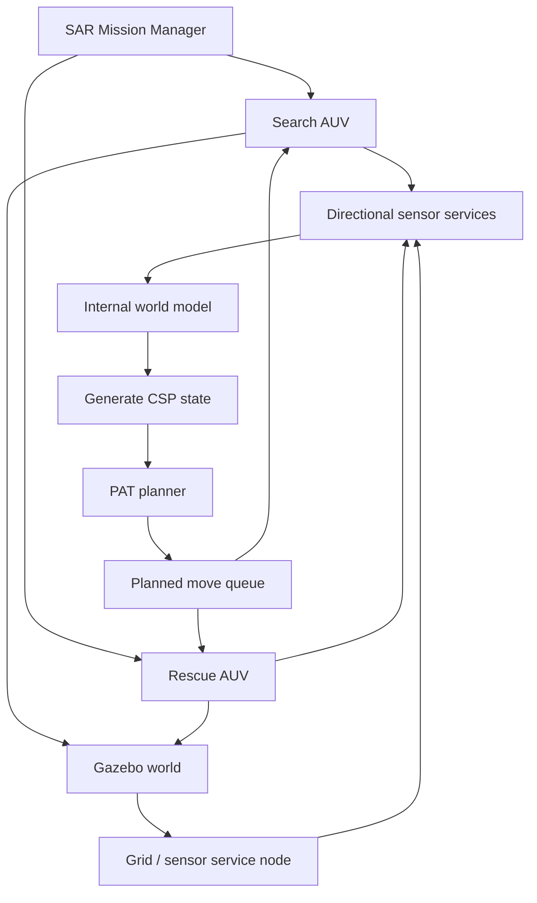

# Multi-Agent Aquatic Search & Rescue

A ROS and Gazebo autonomy project that coordinates specialised search and rescue AUVs in a partially observable grid environment.

A **Search AUV** explores the environment, discovers survivors and hazards, and continuously updates its internal world model. A **Rescue AUV** then plans safe routes to recover survivors. A mission manager coordinates the search and rescue phases, while PAT/CSP models generate high-level plans from the latest known state.

## What this project demonstrates

- Multi-agent robotic mission design
- ROS service-based communication in C++
- Partial observability and internal world modelling
- Dynamic replanning as new hazards and survivors are discovered
- Formal high-level planning with PAT/CSP
- Gazebo simulation and environment synchronisation
- Capacity-aware rescue planning
- Separation of mission coordination, sensing, planning, and execution

## System architecture



## Mission flow

1. A random 8x8 world is generated with survivors and hostile cells.
2. The Search AUV begins with incomplete knowledge of the environment.
3. Directional sensor services reveal nearby hazards and survivors.
4. The AUV updates its internal map and regenerates a formal CSP world model.
5. PAT produces a route consistent with the currently known environment.
6. New observations trigger replanning when required.
7. Once the search phase completes, the Rescue AUV retrieves survivors while respecting capacity and obstacle constraints.
8. Both mission phases finish by returning safely to the home position.

## Core components

| Component | Responsibility |
| --- | --- |
| `src/search_rescue_search.cpp` | Exploration, sensing, world-model updates and search replanning |
| `src/search_rescue_rescue.cpp` | Survivor collection, capacity management and rescue replanning |
| `src/search_rescue_manager.cpp` | Mission-phase coordination |
| `src/update_grid.cpp` | Gazebo world synchronisation and sensor services |
| `pat/*.csp` | Formal planning models for exploration, rescue and return-home behaviour |
| `srv/Sensor.srv` | Directional object-detection service |
| `srv/UpdateGrid.srv` | World-state update service |

## Stack

- C++
- ROS Noetic
- Gazebo
- PAT / CSP
- Catkin
- Formal planning
- Multi-agent autonomy

## Build

Clone into a ROS Noetic catkin workspace:

```bash
cd ~/catkin_ws/src
git clone https://github.com/jackmillington/auv-aquatic-search-and-rescue.git

cd ~/catkin_ws
catkin_make
source devel/setup.bash
```

## PAT configuration

The planner expects the PAT console executable at:

```text
tools/PAT3.Console.exe
```

The executable is not distributed in this repository. Install PAT separately and place or link the console executable at that path.

## Run

Start the Gazebo environment:

```bash
roslaunch auv_search_rescue launch_world.launch
```

Start the grid and sensor services:

```bash
rosrun auv_search_rescue update_grid
```

Then start the mission manager:

```bash
rosrun auv_search_rescue search_rescue_manager
```

The manager runs the search phase first, then launches the rescue phase after a successful search mission.

## Planning model

The AUVs do not receive a complete map. They build a local representation from sensor observations and repeatedly generate a CSP state for PAT. Planning therefore follows a continuous cycle:

```text
Sense -> Update map -> Generate model -> Plan -> Execute -> Observe -> Replan
```

This keeps high-level planning separate from ROS execution while allowing newly discovered information to alter future actions.

## Contributors

Originally developed collaboratively by:

- Jack Millington
- Jayden Knight
- Callum Brown
- Yusuf Abushaaban

## License

MIT.
